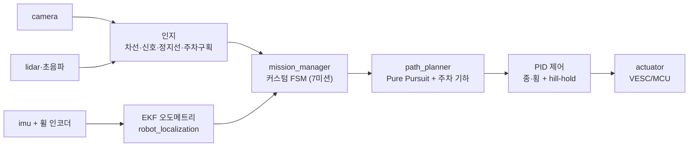
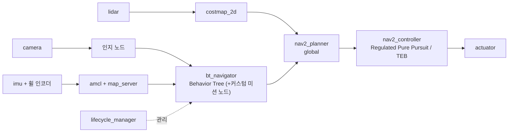

← [[00_Home]] | [[MOC_AVP-ROS]] | [[HL FMA 2026|📋 상위: 대회 개요·규정]]

# 🛠️ HL FMA 2026 — 개발 전략 문서

> **위치** [[2026-07-07_윤성웅_HL FMA 통합작전문서.pdf|통합 작전 문서]](무엇을·왜)를 **개발 관점(어떻게·누가·언제)**으로 옮긴 실행 문서.
> 작전 문서 = 코스·미션·감점 분석 / 본 문서 = ROS2 아키텍처·모듈·일정·역할.
> **기준일** 2026-07-07 · **본선** 2026-09-20 (D-75) · 리빙 도큐먼트(계속 갱신).

---

## 0. 개발 대원칙 (승부 구조에서 도출)

작전 문서 §0의 2단계 승부 구조가 **엔지니어링 우선순위를 그대로 결정**한다.

| 승부 단계 | 개발 원칙 | 함의 |
|-----------|-----------|------|
| 1차: 미션 **무감점 완주** | **강건성 우선(Robustness-first)** | 화려한 인지보다 "흔들려도 스스로 복구"하는 폴백·오도메트리 브리징이 완주율을 가른다. |
| 2차: **랩타임** | 무감점 확정 **후에만** 속도 | 속도 최적화는 Phase 4. 조기 속도 추구 = 미션 실패. |

- **설계 철학**: "느려도 감점 없이 끝까지" → 실패 시 **안전 측(정지) 폴백**을 모든 판단 노드의 기본값으로.
- **최대 약점 = "비전이 흔들리는 순간"** → 비전 단독 판단 지양, **[[IMU]]+휠 인코더 오도메트리 융합**으로 메운다. (작전 문서 §6)
- **과한 딥러닝 경계**: 본 코스는 장내기능시험형(차선추종·신호·주차)이라 **고전 CV+상태머신+제어**가 주력. [[BEV]]/[[LSS]]·[[Occupancy]] 등 학습 기반은 **선택적 보강/연구 트랙**으로 분리(핵심 경로 아님). → §7 참조.

---

## 1. 시스템 아키텍처 (ROS2 노드 그래프)

```
[센서 계층]                [인지]                    [판단]                 [제어]           [구동]
camera_node ─┬─▶ lane_detection ───────┐
             ├─▶ trafficlight_detection ┤
             ├─▶ stopline_detection ────┼─▶ mission_manager ─▶ path_planner ─▶ pid_controller ─▶ actuator
             └─▶ parking_slot_detection ┤   (상태머신/BT)        (pure pursuit)   (종/횡 제어)     (VESC/MCU)
lidar/ultrasonic ─▶ obstacle_detection ─┘        ▲
imu + wheel_enc ─▶ ekf_localization ─────────────┘ (오도메트리·자세, 차선 미검출 시 브리징)
                                          rosbag(로깅) · rviz/sim(검증) · param(튜닝)
```

- **미들웨어**: ROS2 (Humble 권장, Ubuntu 22.04 / Jetson). 통신은 [[Topic]](센서 스트림)·[[Service]](상태 질의)·[[Action]](주차 등 장기 태스크). [[DDS]] QoS는 센서 best-effort / 제어 reliable.
- **판단 코어 = `mission_manager`**: 7개 미션을 노드로 갖는 **상태머신 또는 Behavior Tree**. [[W3_Seminar#4. ROS2 Navigation Stack (Nav2) 구조|Nav2 BT]] 구조 차용 가능(단, 전체 Nav2는 과할 수 있어 경량 커스텀 우선 검토).
- **조향 주의**: 1/5 스케일은 **Ackermann 조향**(전/후륜). Nav2 기본 DWB는 diff-drive 전제 → **Regulated Pure Pursuit** 또는 [[W3_Seminar#5. 로컬 경로 계획 — DWA · TEB|TEB(ackermann 지원)]] 사용.

---

## 2. 소프트웨어 스택 · 센서 매핑

| 계층 | 후보 기술 | 관련 노트 |
|------|-----------|-----------|
| OS/미들웨어 | Ubuntu 22.04 + ROS2 Humble | [[Workspace]] · [[Node]] |
| 비전 | [[OpenCV]] (차선/정지선/신호 HSV·색공간), 선택적 [[YOLO]](신호등/객체) | [[OpenCV]] · [[YOLO]] |
| 거리/장애물 | [[LiDAR]] 2D(또는 초음파) — 주차 거리·정지선 융합·장애물 | [[LiDAR]] |
| 상태추정 | `robot_localization`(EKF): [[IMU]] + 휠 인코더 융합 | [[IMU]] |
| 계획 | 상태머신 + Pure Pursuit / 주차 기하 경로 | [[W3_Seminar]] |
| 제어 | [[W3_Seminar#6. PID 제어|PID]] (종·횡), hill-hold | [[W3_Seminar]] |
| 검증 | rosbag, rviz, 시뮬레이터(H-Mobility 등) | [[W1_Seminar]] |

- **센서 우선순위(작전 §6)**: ① 전방 카메라(메인 비전) ② 라이다/초음파(주차·거리) ③ **IMU+휠 인코더(강건성 핵심)**. 300만원·24V 규정 내 구성.
- **연산장치**: ✅ **Jetson Orin Nano 확정**. 경량 플랫폼 → **비전 경량화·딥러닝 최소화 전제**(§7), 전력 예산 관리 중요. 계획 스택도 경량 지향과 궁합 검토(→ 부록 A).

---

## 3. 미션별 개발 모듈 (7 미션 → 구현)

작전 문서 §2를 인지/판단/제어 + **주 담당 패키지**로 매핑. 리스크 등급은 작전 문서 실측 기준 기반.

| # | 미션 | 핵심 모듈 | 인지 | 판단 | 제어 | 리스크 |
|---|------|-----------|------|------|------|--------|
| ① | 경사로 정지 | `hill_stop` | 정지선 검출 + IMU 피치 | 감속→완전정지→3초→재출발 | **hill-hold**(밀림방지)·재출발 토크 | 🔴 실격(밀림/30초) |
| ②③ | 신호 직진 ×2 | `traffic_fsm` | 신호색(HSV+화면상단 위치필터) | 녹→통과/적→정지/황→거리, 미검출=정지폴백 | 통과 시 감속최소, 위험구간 속도상한 | 🟡 감점(신호위반) |
| ④ | T자 주차 | `parking_t` (Action) | 구획선 + 연석 거리(라이다/초음파) | 진입→정차→후진→조향시퀀스→정착 | 저속 정밀 후진, 휠인코더 거리/각, **절체 복구** | 🟠 정밀제어 |
| ⑤ | 신호 좌회전 | `turn_left` | 좌회전 신호 + 회전후 진입차선 조기확보 | 정지→대기→회전경로, 미검출시 오도메트리 브리징 | 급조향 후륜슬립 억제 | 🔴 **실격(1회 이탈)** |
| ⑥ | 철길 요철 | `bump_pass` | 요철 사전감지(위치/패턴) | 진입전 감속→통과중 자세안정→후 가속 | IMU 발산방지(EKF), 조향 고정 | 🟢 |
| ⑦ | 평행 주차 | `parking_parallel` (Action) | 평행구획 + 측/후방 거리 | 옆정차→사선후진→정렬→정착 | 2단 조향(꺾기→되꺾기), 사전 파라미터 튜닝 | 🟠 정밀제어 |

- **공통 인지 기반**: 차선 추종(`lane_follow`)은 전 구간 상시 동작 → **최우선 안정화 대상**.
- **주차 2종(④⑦)**: 별도 파라미터 세트지만 "정차→후진→정렬→정착" 공통 골격 → `parking_base` 공유 라이브러리로.

---

## 4. 공통 인프라 (강건성의 실체)

작전 문서가 반복 강조한 "완주율을 가르는" 요소들 = 별도 미션이 아니라 **횡단 인프라**.

1. **상태머신/BT 프레임워크** (`mission_manager`) — 미션 전이·실패 복구·타임아웃. 교차로 30초↑ 정차 = 실격이므로 **판단 지연 방지 타임아웃** 필수.
2. **오도메트리 브리징** — 차선/신호 미검출 구간을 EKF dead-reckoning으로 잇고, 재포착 시 보정. (⑤ 좌회전·⑥ 요철 통과 중 핵심)
3. **폴백 정책** — 모든 인지 노드에 "불확실 → 안전측(정지/감속)" 기본값. "확실치 않으면 정지"(작전 §2).
4. **절체 복구 로직** — 주차 실패 시 전진 재정렬. (영상 팀도 후진 방향 오류를 즉시 보정해 성공)
5. **로깅/재현** — rosbag 전 주행 기록 → 실패 구간 오프라인 재현·튜닝. 실차 시간이 귀하므로 **시뮬레이터 선행 검증**.

---

## 5. 개발 로드맵 (일정 앵커에 매핑)

작전 문서 §5의 Phase 1~4를 실제 일정([[HL FMA 2026#🗓️ 일정]])에 배치. **오늘 7.7 → 본선 9.20, 약 10.5주.**

| 기간 | Phase | 목표 | 산출물 |
|------|-------|------|--------|
| **7.7 ~ 7.28** (설명회) | **P0 셋업** | 규정·코스 확정, HW/센서 확정, ROS2 워크스페이스·시뮬 환경, 차선추종 PoC | 스캐폴딩·센서 드라이버·시뮬 |
| **7.28 ~ 8.17** | **P1 완주 기반** | 차선추종 안정화→정지선/신호→경사정지→**상태머신 골격**. "느려도 감점 없이" | 7미션 상태 전이 동작(저속) |
| **8.17 ~ 8.31** | **P2 정밀 미션** | T자·평행 주차 궤적, 요철 자세안정, 좌회전 탈선방지. **주차 조기착수**(튜닝 최장) | 주차 재현성·좌회전 성공 |
| **8.31 ~ 9.5** | **P3 강건성** | 오도메트리 브리징, 폴백, 조도/경사/요철 복구, **우천 대응** | 실차 투입 준비 완료 |
| **9.5 ~ 9.6** | 🚩 **자율연습** | 실차 캘리브레이션, **코스 데이터 수집**, 실환경 갭 측정 | 실차 튜닝 로그 |
| **9.6 ~ 9.19** | **P4 속도 최적화** | 직선 가속·미션 진출입 감속 프로파일·불필요 정지 제거로 랩타임 단축 | 무감점 전제 시간 단축 |
| **9.19 / 9.20** | 🏁 예선/본선 | 기능점검 → 본선 | — |

> ⚠️ **후반부 리스크**: 정밀 저속 주차(④⑦)가 코스 후반에 몰려 있어 **배터리·모터 저하·누적오차**가 겹친다(작전 §4). 후반 주차 제어 안정성을 특히 확보.

---

## 6. 역할 분담 (✅ 팀 확정 2026-07-07)

4인([[HL FMA 2026#👥 팀 (4인)]]).

| 팀원 | 담당 | 범위 |
|------|------|------|
| **윤성웅** | **전체 산출물 관리 (총괄)** | 통합·일정·문서·의사결정 조율, 각 파트 인터페이스 정의. [[BEV]] 연구 트랙(§7) 병행. |
| **육시우** | 계획·제어 | 경로계획(상태머신·Pure Pursuit), [[W3_Seminar#6. PID 제어\|PID]], 주차 궤적. |
| **최민규** | 인지·시스템 | 비전([[OpenCV]] 차선·신호·정지선·주차 구획), 센서 데이터 처리. |
| **이준하** | 인프라·통합 | 통신([[Topic]]·[[Service]]·[[Action]]), 상태머신 골격, 로깅(rosbag)·시뮬·빌드. |

> 주차(④⑦)는 튜닝이 무거워 **계획·제어(육시우) + 인지(최민규) 페어**로 진행. 총괄(윤성웅)이 파트 간 인터페이스·통합 일정 관리.

---

## 7. 학습 기반 인지(BEV/Occupancy)의 위치 — 핵심 경로 아님

- 본 코스는 **정형 장내 코스**라 고전 CV+상태머신으로 완주 가능. [[LSS]]·[[BEVFormer]]·[[Occupancy]]·[[ParkGaussian]]은 **완주의 필수 요소가 아니다.**
- **연구/보강 트랙으로 분리**: (a) 주차 인지 정밀화 실험, (b) 대회장 오프라인 3D 맵/디지털 트윈([[ParkGaussian]], 코드 공개 후), (c) 발표·포트폴리오 자산.
- **원칙**: P1~P3 완주·강건성이 확보되기 전에는 여기에 자원 투입 금지. 여유가 생기면 P4 이후 보강.
- 관련 실행 기반: [[LSS_실행_Runbook]] · [[BEVFormer_실행_Runbook]] (별도 GPU 머신 필요).

---

## 8. 리스크 & 대응

| 리스크 | 영향 | 대응 |
|--------|------|------|
| 코스·미션 2024 기준 (변동 가능) | 개발 방향 오류 | **당해 규정집·코스도 확인**(설명회 7.28), 유연한 상태머신 |
| 좌회전 1회 이탈 = 실격 | 완주 실패 | 진입차선 재포착·오도메트리 브리징 최우선 |
| 실차/시뮬 도메인 갭 | 실전 성능 저하 | 자율연습(9.5)에서 실측·재튜닝, rosbag 기반 오프라인 보정 |
| 후반부 배터리·누적오차 | 주차 실패 | 전력 예산 관리, 후반 제어 안정성 강화 |
| 우천 | 인식 저하·규정 요구 | 방수·노출/HSV 강건화, 우천 폴백 주행 방안 마련 |
| Jetson 연산 한계 | 실시간성 | 비전 경량화, 딥러닝 최소화(§7) |

---

## 9. 결정 현황

**✅ 결정됨 (2026-07-07)**
- **역할 분담** — §6 확정.
- **연산장치** — **Jetson Orin Nano**. (경량 → 딥러닝 최소화 전제)

**🔲 미결정 (결정 필요)**
- 🔲 **차량 모델**(T870/T8/F8 등) 및 구동/조향(Ackermann 파라미터) — 팀 논의 미정.
- 🔲 **계획(Planning) 스택**: 경량 커스텀 vs Nav2 — **→ 부록 A 비교 참조 후 결정.** (Orin Nano 경량 지향과 궁합이 판단 축)
- 🔲 센서 최종 구성(카메라 화각·라이다 2D/3D·초음파 개수) — 300만원/24V 내.
- 🔲 **시뮬레이션 환경** 선정(H-Mobility / Gazebo / CARLA 등) 및 코스 재현 수준.
- 🔲 코드 저장소 구조(현 볼트와 별개 개발 리포 필요 여부).

---

## 10. 다음 할 일 — 미결정 결정 액션

§9 미결정 항목을 **담당·기한·판단 근거**와 함께 실행 항목으로 전개. 기한은 일정 앵커([[HL FMA 2026#🗓️ 일정]]) 기준.

| 결정 항목 | 담당 | 기한 | 액션 / 판단 근거 |
|-----------|------|------|------------------|
| ☐ **코드 저장소 구조** 확정 (볼트와 별개 개발 리포 여부) | 이준하(인프라) | ~7.14 | 가장 먼저 필요 — 개발 착수 전제. 리포 생성·CI·브랜치 전략. |
| ☐ **시뮬레이션 환경** 선정 (H-Mobility/Gazebo/CARLA) | 이준하(인프라) | ~7.28 | P1 착수 전 필수. 코스 재현 수준·Ackermann 지원·Orin 부담 검토. |
| ☐ **센서 구성** 확정 (카메라 화각·라이다 2D/3D·초음파 수) | 최민규(인지)+총괄 | ~7.28 | 300만원/24V 규정 내. 드라이버 개발 전제 → 조기 확정. |
| ☐ **차량 모델**(T870/T8/F8) + 조향(Ackermann 파라미터) | 총괄+육시우(제어) | ~8.1 (설명회 후) | 당해 규정·차량 키트 확인(설명회 7.28) 후 확정. |
| ☐ **계획 스택** 확정 (경량 커스텀 vs Nav2) | 육시우(계획) | ~8.10 (P0 후) | 부록 A 비교 → **P0 프로토타입으로 실측 후** 결정. 권고=경량 커스텀. |

- **크리티컬 패스**: 리포·시뮬·센서(→7.28)가 P1 완주 개발의 전제. 늦으면 로드맵(§5) 전체가 밀린다.
- 각 항목 결정 시 **§9 "결정됨"으로 이동 + 관련 절 갱신**. 미해결 항목은 **대회설명회(7.28)** 를 정보 획득 마감으로 삼는다.

---

## 부록 A. 계획 스택 비교 — 경량 커스텀 vs Nav2

> §9 미결정 항목 결정용. **판단 축 = Jetson Orin Nano(경량) + 정형 미션 코스**.

### A-1. 경량 커스텀 스택
자체 상태머신 + Pure Pursuit를 직접 구현. 코스 특화·경량.



- **개발 아웃라인**: ① FSM 프레임워크(전이·타임아웃·폴백) → ② 미션별 상태 구현(§3) → ③ Pure Pursuit 횡제어 튜닝 → ④ 주차 기하 경로(④⑦) → ⑤ 오도메트리 브리징·복구.
- **장점**: **경량**(Orin Nano 적합) · 코스 특화 최적화 · 디버깅/제어 흐름 단순 · 의존성 최소 · 지연 예측 쉬움.
- **단점**: 상태머신·복구·장애물 회피를 **직접 구현** · 재사용성↓ · 초기 골격 설계 부담.

### A-2. Nav2 스택
검증된 ROS2 내비게이션 스택. BT·코스트맵·플래너 재사용. ([[W3_Seminar#4. ROS2 Navigation Stack (Nav2) 구조|W3 §4]])



- **개발 아웃라인**: ① 코스 맵 작성(SLAM/수동) → ② amcl·costmap·컨트롤러 yaml 튜닝 → ③ **Ackermann 컨트롤러**(RPP/TEB) 설정 → ④ 미션을 **커스텀 BT 노드/플러그인**으로 구현(신호·주차) → ⑤ recovery behavior 연결.
- **장점**: 검증된 스택 · **BT 복구 행동·코스트맵·장애물 회피 기본 제공** · 확장성·커뮤니티 · 정밀 로컬라이제이션.
- **단점**: **무거움**(Orin Nano 부담) · yaml 설정 복잡 · **맵 필요**(정형 코스엔 과할 수 있음) · Nav2는 goal-to-goal 내비 전제라 **미션 시퀀스형 코스와 궁합 조정** 필요 · Ackermann 설정 난이도.

### A-3. 비교 요약 & 권고

| 기준 | 경량 커스텀 | Nav2 |
|------|:---:|:---:|
| Orin Nano 적합성 | ✅ 높음 | ⚠️ 부담 |
| 초기 구축 속도 | 🟡 골격 직접 | 🟡 설정 복잡 |
| 미션 시퀀스 코스 궁합 | ✅ 자연스러움 | ⚠️ BT 커스텀 필요 |
| 복구·장애물 회피 | 🔴 직접 구현 | ✅ 기본 제공 |
| 확장성·재사용 | 🟡 낮음 | ✅ 높음 |
| 디버깅·지연 예측 | ✅ 단순 | 🟡 복잡 |

> **권고**: **경량 커스텀을 주력**으로 하되(Orin Nano·정형 미션 코스에 부합), **Nav2의 좋은 부분만 차용** — 특히 로컬 컨트롤러는 **Regulated Pure Pursuit** 개념, 판단부는 **Behavior Tree 사고방식**을 참고. 전체 Nav2 도입은 맵·설정·연산 비용 대비 이득이 정형 코스에선 크지 않음. **최종 결정은 P0에서 프로토타입 후 확정.**

---

## 관련 노트
- [[HL FMA 2026]] — 📋 상위: 대회 개요·규정·일정
- [[2026-07-07_윤성웅_HL FMA 통합작전문서.pdf]] — 원본 작전 문서(코스·미션 분석)
- [[W3_Seminar]] — 경로계획·Nav2·DWA/TEB·PID·서비스·BEV
- [[00_Seminar_Home]] · [[MOC_AVP-ROS]]
