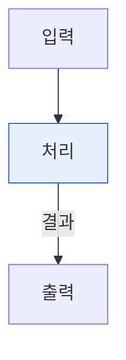

# 🏗️ Hand-off ver2 — 옵시디언 연구 볼트 구축 노하우

> **목적**: 새 주제로 옵시디언 볼트를 팔 때, 이 문서 하나로 동일한 스타일을 바로 재현한다.
> **사용법**: 새 대화 첫 메시지에 이 파일을 붙여넣고 "이 노하우대로 `{주제}` 볼트를 세팅해줘"라고 요청.
> **ver1 대비 변경점**: ① `_templates/` + 코어 Templates 플러그인 워크플로 정식화 · ② `_sources/`(원문 보관) 지원 폴더 추가 · ③ `.base` 트래커의 **실제 위치는 `_meta/`** (필터가 행을 정하므로 위치 자유)임을 반영 · ④ 부트스트랩/체크리스트 갱신. 자세한 차이는 각 절의 `🆕 ver2` 표시 참고.

---

## 0. 설계 철학 (왜 이렇게 하는가)

- **번호 접두사 = 정보 흐름**: `00`(허브) → `01~03`(콘텐츠) → `04~05`(작업) → `99`(데일리). 폴더 정렬 순서가 곧 연구 진행 순서.
- **`_` 접두사 = 지원 폴더**: 콘텐츠가 아닌 것(첨부·메타·템플릿·원문)은 번호 흐름 밖으로 분리.
- **모든 노트는 그래프 노드**: `[[위키링크]]`로 촘촘히 연결 → 그래프 뷰에서 지식 구조가 보이게.
- **모든 노트는 논문/산출물 재료**: frontmatter·구조를 통일해 나중에 그대로 글쓰기로 전환.
- 🆕 **수작업 최소화**: 반복되는 frontmatter·골격은 외우지 말고 `_templates/`에서 한 번에 삽입(아래 5절).

---

## 1. 폴더 구조 (표준 골격)

```
{볼트 루트}/
├── 00_Home.md           ← 진입점 (루트엔 이 파일만!)
├── 00_MOC/              ← Map of Content (전체 지도)
├── 01_Papers/           ← 논문/문헌 정리
├── 02_Concepts/         ← 개념·용어 노트 (지식 베이스 핵심)
├── 03_Projects/         ← 프로젝트/제안서 원문
├── 04_Dataset/          ← 데이터·실험 자료
├── 05_Research/         ← 연구 워크플로 (아래 세부)
│   ├── 01_LitReview/
│   ├── 02_Idea/
│   ├── 03_Experiment/
│   ├── 04_Writing/
│   └── 05_Submission/
├── 99_Daily/            ← 일일 노트
│   └── _attachments/    ← 데일리 첨부 이미지
├── _attachments/        ← (폴더별 자동 생성됨)
├── _templates/          ← 🆕 노트 템플릿 모음 (코어 Templates 플러그인)
├── _sources/            ← 🆕 원문 자료 보관 (논문 PDF·캡처·외부 문서 원본)
└── _meta/               ← 핸드오프·세팅·트래커 등 메타 문서 (비콘텐츠)
```

**한 줄 부트스트랩** (Git Bash):
```bash
mkdir -p 00_MOC 01_Papers 02_Concepts 03_Projects 04_Dataset \
  05_Research/{01_LitReview,02_Idea,03_Experiment,04_Writing,05_Submission} \
  99_Daily/_attachments _templates _sources _meta
```

**루트 규칙**: 루트엔 `00_Home.md`만 둔다. 트래커·핸드오프 등은 절대 루트에 방치하지 말고 `_meta/`로.
🆕 **지원 폴더 역할 구분**: `_meta/`=내가 쓴 메타 문서(핸드오프·트래커·정리) · `_sources/`=남이 만든 원문(PDF 등) · `_templates/`=빈 골격 · `_attachments/`=이미지.

---

## 2. 첨부(이미지) 관리 — 폴더별 `_attachments`

이미지는 **단일 중앙 폴더 금지**. 노트와 같은 폴더의 `_attachments/`에 자동 저장 → 노트 이동 시 이미지가 따라다녀 링크 안 깨짐.

**`.obsidian/app.json`에 추가**:
```json
{
  "attachmentFolderPath": "./_attachments",
  "newLinkFormat": "shortest",
  "useMarkdownLinks": false
}
```
> ⚠️ Obsidian이 켜져 있으면 종료 시 이 파일을 덮어쓸 수 있으니, 설정 후 **앱 재시작**. (또는 UI: 설정 → 파일 및 링크 → 첨부 파일 폴더 경로 → "현재 폴더의 하위 폴더" → `_attachments`)

> 🆕 **원문 PDF는 `_attachments`가 아니라 `_sources/`로**. `_attachments`는 노트 본문에 임베드되는 이미지용, `_sources`는 통째로 보관하는 출처 원본용으로 역할을 분리한다.

---

## 3. frontmatter 템플릿 (타입별)

모든 노트는 frontmatter + 역링크 헤더(`← [[00_Home]] | [[MOC_...]]`)로 시작.
🆕 아래 골격은 `_templates/`의 실제 파일과 1:1로 맞춰 둔다. 손으로 베끼지 말고 5절의 플러그인으로 삽입할 것.

### 개념 노트 (`02_Concepts/`)
```markdown
---
title: "{{title}} — {한 줄 부제}"
type: concept
tags: [concept, {태그}]
status: in-progress
aliases: []
---

← [[00_Home]] | [[MOC_{주제}]]

# {{title}}

> **한 줄 정의**
> {핵심을 한 문장으로}

## 핵심 개념
## 본 연구에서의 역할
## 관련 노트
- [[]]
```

### 논문 노트 (`01_Papers/`)
```markdown
---
title: "{{title}}"
type: paper
tags: [paper, {태그}]
authors: ""
year:
venue: ""            # 출처 예: CVPR 2025
status: todo         # todo / read / done
rating:              # 별점 ⭐ 또는 1~5 (직접 입력)
---

← [[00_Home]] | [[MOC_{주제}]] | [[논문 트래커]]

# {{title}}

> **서지** {저자}, {출처}, {연도}
> **역할** {본 연구에서 왜 인용하는가}

## 핵심 기여
## 주요 내용
## 본 연구와의 관련성
## 인용 위치 (vault)   ← 🆕 이 논문을 어느 노트에서 인용하는지 역추적용
## 관련 노트
- [[]]
```

### 일일 노트 (`99_Daily/`, 파일명 `YYYY-MM-DD.md`)
```markdown
---
title: "{{date:YYYY-MM-DD}} Daily — {오늘 초점}"
type: daily
date: {{date:YYYY-MM-DD}}
tags: [daily, {태그}]
---

← [[00_Home]] | [[MOC_{주제}]]

# {{date:YYYY-MM-DD}} Daily

> 오늘의 초점: {한 줄}

## 한 일 (작업)
## 배운 것 (개념)
## 메모
## 다음 할 일
- [ ] ...

## 관련 노트
```

### MOC (`00_MOC/MOC_{주제}.md`)
```markdown
---
title: "MOC — {연구 한 줄}"
type: MOC
tags: [MOC, {태그}]
---

← [[00_Home]]

# 🗺️ MOC — {주제}

> **연구 한 줄 정의**

## 1️⃣ {갈래1}
- [[노트]] — 설명
## 2️⃣ {갈래2}
...
```

---

## 4. 공통 작성 규칙

- **역링크 헤더**: 본문 첫 줄에 항상 `← [[00_Home]] | [[MOC_{주제}]]`.
- **위키링크 적극 사용**: 아직 없는 노트도 `[[이름]]`으로 미리 링크 → 나중에 채울 곳 표시(빨간 링크 = 할 일).
- **aliases 활용**: 한글/영문/약어 별칭을 넣어 어떤 표기로도 링크 연결되게.
- **파일명**: 개념은 자연어 제목(`Safety Filter.md`), 논문은 `{짧은이름}_{저자}_{연도}.md`.
- **수식**: `$...$`(인라인) / `$$...$$`(블록) — Obsidian 기본 렌더.
- **status 값 통일**: 논문 `todo/read/done`, 개념 `in-progress/done`.

---

## 5. 🆕 노트 템플릿 — 코어 Templates 플러그인 (`_templates/`)

ver1에선 frontmatter를 매번 손으로 붙였지만, ver2는 `_templates/`에 빈 골격을 두고 **삽입**한다.

**플러그인 설정 (최초 1회)**:
1. `설정 → 코어 플러그인 → 템플릿(Templates)` 켜기
2. `설정 → 템플릿 → 템플릿 폴더 위치` → **`_templates`** 지정
3. (선택) `설정 → 단축키 → "템플릿 삽입"`에 키 할당

**사용 흐름**:
1. 새 노트를 **올바른 폴더**에 생성 (개념→`02_Concepts`, 논문→`01_Papers` …)
2. 파일명 = 노트 제목 (`{{title}}`가 이 이름으로 치환됨)
3. `Ctrl+P` → "템플릿 삽입" → 해당 템플릿 선택

**템플릿 목록** (각각 3절 골격과 동일):

| 템플릿 | 대상 폴더 | type |
|--------|----------|------|
| `Concept.md` | `02_Concepts/` | concept |
| `Paper.md` | `01_Papers/` | paper |
| `Daily.md` | `99_Daily/` | daily |
| `MOC.md` | `00_MOC/` | MOC |
| `Project.md` | `03_Projects/` | project |

**치환 변수**: `{{title}}`(파일명) · `{{date}}`/`{{date:YYYY-MM-DD}}` · `{{time}}`.

**삽입 후 채울 것**: `tags`/`aliases`/`authors·year·venue`(논문) · 역링크 헤더의 `MOC_{주제}` · `관련 노트`의 `[[]]`.

> 폴더별 자동 분기·고급 변수가 필요하면 **Templater** 커뮤니티 플러그인으로 전환:
> `{{title}}` → `<% tp.file.title %>`, `{{date:YYYY-MM-DD}}` → `<% tp.date.now("YYYY-MM-DD") %>`.
> `_templates/README.md`에 이 사용법을 같이 보관해 둘 것.

---

## 6. 논문 트래커 (Obsidian Bases)

`.base` 파일은 논문 노트 frontmatter를 자동으로 표로 집계한다.

> 🆕 **위치는 자유**: ver1은 `01_Papers/`에 두라 했지만, **행을 정하는 건 `filters`이지 파일 위치가 아니다**. 실제로는 `_meta/논문 트래커.base`에 두고 `file.folder.contains("01_Papers")`로 대상 폴더를 스코프한다. 메타 산출물은 `_meta/`로 모으는 게 깔끔. (단 `[[논문 트래커]]` 위키링크는 파일명 기준이니 파일명은 고정.)

**`_meta/논문 트래커.base`** (복붙):
```yaml
properties:
  note.status:
    displayName: 상태
  note.venue:
    displayName: 출처
  note.rating:
    displayName: 별점
views:
  - type: table
    name: 표
    filters:
      and:
        - file.folder.contains("01_Papers")
        - note.type == "paper"
    groupBy:
      property: status
      direction: ASC
    order:
      - file.name
      - status
      - venue
      - rating
    sort: []
```

**핵심 문법**:
- `order` = 표에 보일 **컬럼**(이게 없으면 이름만 뜸).
- `filters` = 보일 **행**(`file.folder.contains("01_Papers")` + `note.type == "paper"`로 논문만). ← 위치 무관하게 행을 결정.
- `groupBy` = 상태별 묶음.
- 프로퍼티는 `note.{이름}` 또는 그냥 `{이름}`. **하이픈(`ref-id`) 든 키는 피할 것** → `ref` 처럼 단순 식별자로.
- 별점은 자동 ⭐ 렌더 안 됨 → frontmatter `rating:`에 `⭐⭐⭐` 또는 숫자 직접 입력.

---

## 7. Mermaid 다이어그램

이미지 첨부 대신 **글로 그리는 다이어그램** → 코드라 수정·검색·버전관리 쉬움. Obsidian 읽기 모드에서 자동 렌더.

````markdown

````

---

## 8. AI 어시스턴트에게 줄 규칙

새 대화에서 볼트 작업을 맡길 때 아래를 기대:

- **언어**: 한국어 응답.
- **파일 위치 명시**: 노트 생성 시 항상 어느 폴더인지 밝힘.
- **frontmatter 필수**: 모든 노트에 `title/type/tags/status`. 🆕 가능하면 `_templates/`의 골격과 일치시킬 것.
- **역링크 헤더 + 위키링크**: 그래프 연결 의식.
- **정직성**: 모르는/미확인 내용은 지어내지 말고 `⚠️ 원문 확인 필요` + 체크리스트로 남길 것.
- **파괴적 작업 전 확인**: 파일 이동/삭제·덮어쓰기 전 내용 확인.
- **첨부**: 폴더별 `_attachments` 규칙 준수. 원문 PDF는 `_sources/`.

---

## 9. 빠른 부트스트랩 체크리스트

- [ ] 폴더 골격 생성 (1번 부트스트랩 명령 — `_templates`·`_sources` 포함)
- [ ] `.obsidian/app.json` 첨부 설정 (2번) → Obsidian 재시작
- [ ] 🆕 코어 Templates 플러그인 켜고 폴더를 `_templates`로 지정 (5번)
- [ ] 🆕 `_templates/`에 Concept·Paper·Daily·MOC·Project 골격 + `README.md` 배치
- [ ] `00_Home.md` 작성 (연구 목표·핵심 요약·참고문헌 인덱스)
- [ ] `00_MOC/MOC_{주제}.md` 작성 (갈래별 지도)
- [ ] `02_Concepts/`에 핵심 개념 노트들
- [ ] `01_Papers/`에 논문 노트 + `_meta/논문 트래커.base`
- [ ] `99_Daily/`에 첫 데일리 노트
- [ ] 이 핸드오프를 `_meta/`에 보관

---

> 이 문서 자체도 `_meta/`에 두고, 새 볼트마다 복사해 `{주제}`만 바꿔 쓰면 됩니다.
> ver1(`Vault_Setup_Handoff.md`)은 이력 참고용으로 남겨두고, 신규 세팅은 이 ver2를 기준으로 한다.
